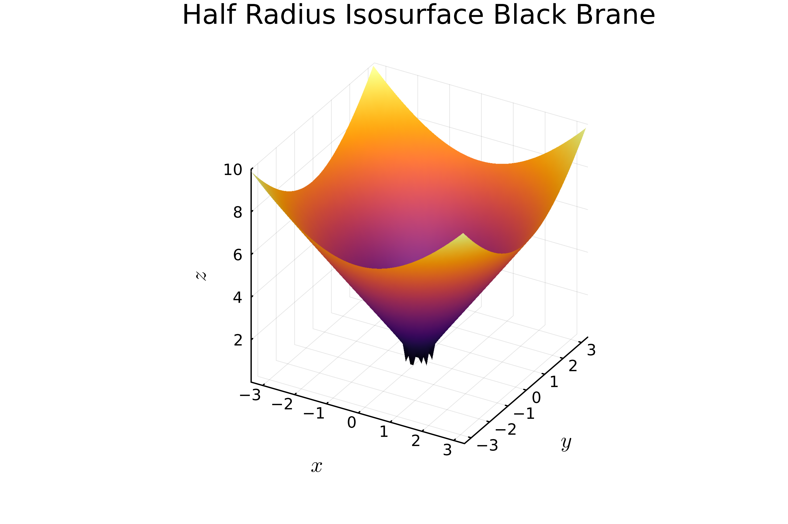

<!--toc:start-->
- [Background](#background)
- [Motivation](#motivation)
## Vortex String Approximation (Numerics)

- [Summary of Results](#summary-of-results)
- [Results in Detail](#results-in-detail)
- [Conclusion](#conclusion)
<!--toc:end-->

# Background

Anti-de Sitter/Conformal Field Theory (AdS/CFT) correspondence (Maldacena 1997)

- dynamic duality between large color gauge field $(3+1)D$ and gravity $(4+1)D$
- non-perturbative calculations of large coupling field theories

## Condensed Matter

AdS/CFT applied to condensed matter

- quantum Hall effect (Hartnoll 2007, Fujita 2009)
- Nernst effect (Hartnoll 2007)
- superconductivity (Hartnoll 2008, Domenech 2010)
- Aharonov-Bohm effect (Montull 2011)
- Lifshitz scaling (Kachru 2008)
- superfluidity and superconductivity (Hartnoll 2008)

## Hologrpahic Superfluids and Superconductors

Hartnoll et al. (Hartnoll 2008): superconductivity in holography

- $U(1)$ scalar field condensation
- critical temperature

## Vortices

Canonical holographic superconductivity bulk theory
: $(3+1)$-dimensional Abelian-Higgs model

- better understanding the Bose-Einstein Condensates (BECs) like systems at strong coupling
- Many papers found induced vorties on the dual boundary theory (Albash 2009, Dias 2013, Wittmer 2020, Wittmer 2021).

# Motivation

We analyze bulk $U(1)$ vortices and it's associated vacuum.

We wanted to know

- alternative approach to the breaking of the global $U(1)$ symmetry in the bulk
- find alternative ways to induced symmetry breaking on the boundary
- our model is different from past works because our U(1) theory is global

# Summary of Results

- Analyzed a bulk, global $U(1)$ $\phi^4$ + $(3+1)$D AAnti-de Sitter (AdS) GR
    - Hard Wall
    - Black Brane

$$S = - \int \sqrt{-g} \left(g^{\mu\nu}\left(\partial_{\mu}\right)\left(\partial_{\nu}\phi\right)^\star + \frac \lambda2 \left( |\phi|^2 + \frac{m^2}{\lambda} \right)^2 \right)$$

$$g = \frac {L^2}{z^2} \left( -f(z) dt^2 + \frac 1{f(z)}dz^2 + \delta_2 \right)$$

## Bulk Global U(1) Breaking Vacuum

**Found that a $U(1)$, bulk breaking vacuum was allowed if**

- $\displaystyle \lim_{z\to 0}\phi \sim z^0$
- $m^2 = -L^2 \lambda$

**This vacuum is**

- linearly stable against "sourceless" perturbations
- exhibits breaking of the $U(1)$ symmetry

## Single Bulk Vortex Solution

**Found single, static numerical solution**

- has the form $\phi = g(r, z) e^{ik\theta}$
- constant $z$ slices are vorticies with a coupling $\propto \lambda/z^2$
    - or $R_{\text{vortex}} \propto z/\sqrt\lambda$
- is singular at the boundary

## Vortex String Approximation

**Studied vortex string approximation as pairs of vortices**

- between vortex-vortex (and vortex-antivortex) configurations
- radial profile must obey Neumann boundary conditions
- singular at the boundary
- found flat radial profiles for large separation distance
- found evidence for $R^{(3)}(0)$ is proportional to a localized scalar VEV

<!-- ----------------------------------------- -->

**Numerically we found**

- Interaction energy vs seperation distance
- Found minimum temperature for given seperation distance

# Results in Detail

## Theory and Background Geometry

**Action**
$$S = - \int \sqrt{-g} \left(g^{\mu\nu}\left(\partial_{\mu}\right)\left(\partial_{\nu}\phi\right)^\star + \frac \lambda2 \left( |\phi|^2 + \frac{m^2}{\lambda} \right)^2 \right)$$

**Metric**
$$g = \frac {L^2}{z^2} \left( -f(z) dt^2 + \frac 1{f(z)}dz^2 + \delta_2 \right)$$

Black Brane
: $f(z) = 1 - z^3/z_h^3$

Hard Wall
: $f(z) = 1$

<!-- ## Equations of motion for Scalar -->

<!-- **Equation of Motion** -->
<!-- $$ -\frac 1{\sqrt{-g}} \partial_\mu \left(g^{\mu\nu} \sqrt{-g} \partial_\nu\phi \right) + V'(|\phi|^2)\phi = 0 $$ -->

## Bulk Global U(1) Breaking Vacuum

**Equation of Motion**
$$ -\frac 1{\sqrt{-g}} \partial_\mu \left(g^{\mu\nu} \sqrt{-g} \partial_\nu\phi \right) + V'(|\phi|^2)\phi = 0 $$

Near horizon expansion where $\phi \sim z^\beta$ implies that
$$
  \left(- \beta \left(\beta - 3\right) + m^2 L^{2}\right) z^\beta + L^{-2\beta}\lambda z^{ 3\beta } = 0
$$

1. $\beta = 0$ and $m^2 = -L^2 \lambda$ or
2. $\beta > 0$

So constant $|\phi|^2=1$ solutions are admitted

## Bulk Global U(1) Breaking Vacuum - Perturbations

Scalar Perturabtions
: $\phi =  1 + v + i \eta$ assuming $|v|, |\eta| \ll 1$

$v$ is a massive scalar field with $m^2 = 2\lambda$

- Leading order diverges, so it must vanish to preserve assumption $|v| \ll 1$

$\eta$ is a massless scalar field

- Leading order solution is constant order

## Single Bulk Vortex Solution

Using the ansatz, $\phi = g(r, z) e^{ik\theta}$

**Scalar equation of motion**
$$
  z^4 \partial_ z\left(\frac{f}{z^2}\partial_ z g\right)
  +\frac { z^2 }{r} \partial_ r\left(r\partial_ r g\right)
  -\frac {z^2}{r^2} k^2 g
  - \lambda \left( g^2 - 1\right) g 
  = 0
$$

## Radius Plots (Hard Wall)

{ height=50% .center }

## Radius Plots (Black Brane)

{ height=50% .center }

## Vortex String Approximation {#squeeze }

At large lenght scales we approxiate vortex solutions as 

$$\phi_i = e^{ \pm i \Theta_i} $$

where $\Theta$ is the angle measured on some constant $z$ plane with respect to a point ($x_i(z)$, $y_i(z)$).

At $2R(0)$ separation at $z=0$, vortex string pair can be written as

\begin{align*}
  \phi_{ 12 } &:= \exp(i(\Theta_1 + s\Theta_2))\\
  \tan( \Theta_1 ) &:= \frac{y}{x - R(z)}\\
  \tan( \Theta_2 ) &:= \frac{y}{x + R(z)}
\end{align*}

$s = 1 \leftrightarrow$ vortex-vortex, $s = -1 \leftrightarrow$ vortex-antivortex  

## Vortex String Approximation (Interaction Energy)

\begin{align*}
  \phi_{ 12 } &= \exp(i(\Theta_1 + s\Theta_2))\\
  \phi_{ 1 } &= \exp(i(\Theta_1))\\
  \phi_{ 2 } &= \exp(i(s\Theta_2))\\
\end{align*}

The interaction energy of the two vortex strings
: $$ \varepsilon := - (S(\phi = \phi_{12}) - S(\phi_2) - S(\phi_1)) $$

## Vortex String Approximation (Equation of Motion)

- Extremizing the energy of $\varepsilon$ with Neumann boundary conditions ($R'(0,z_h) = 0$)
- $R$ obeys second order non-linear ODE.
  - solutions determined by $R(0)$ and $R^{(3)}(0)$
- For found solution the interaction energy diverges so UV cutoff is imposed

## Vortex String Approximation (Large R(0))

For large $R(0)$ the $R(z)$ has an analytical solution

\begin{equation*}
  R(z) = C_1 \int_0^z\frac{y^2 dy}{f(y)}+R(0)
\end{equation*}

Boundary condition at $z = z_h$ requires $C_1 = 0$ and that $R(z) = R(0)$

## Vortex String Approximation (Sourcing the Boundary)

  - treat $\phi_{ 12 } = \exp(i\Theta_{ 12 })$ as free massless scalar field}$

  **Boundary Expansion**
  \begin{align*}
    \sim \phi_{(0)} e^{i \Theta_{12}(R(0))}
      \big(1&+\frac{1}{2} i z^2 R^{(2)}(0) \Theta_{12}'(R(0)) \\
      &+ C_1 \left\langle\mathcal{O}_\phi\right\rangle z^3
      \big)+O(z^4)
  \end{align*}

  **VEV up to a constant**
  $$
    \left\langle\mathcal{O}_\phi\right\rangle \propto R^{(3)}(0) \Theta_{12}'(R(0))
  $$
  $$
    = R^{(3)}(0)  \left( \frac{sy}{\left(y^2 + \left(x + R(0)\right)^2\right)} - \frac{y}{\left(y^2 + \left(x - R(0)\right)^2\right)} \right)
  $$

## Vortex String Approximation (Interaction Energy)

:::::::::::::: {.columns}
::: {.column width="50%"}
  { height=50% .center }
:::
::: {.column width="50%"}
  { height=50% .center }
:::
::::::::::::::

- Vortex-vortex pairs repel and (vice versa vortex-antivortex pairs attract)

## Vortex String Approximation ($z_h$ vs $R(0)$)

  - $z_h$ behavior ($R(0)$ and $R^{(3)}(0)$)
  - Given $R(0)$ and $R^{(3)}(0)$, determine $z_h$ such that $R^{(1)}(z_h) = 0$

:::::::::::::: {.columns}
::: {.column width="50%"}

  | Three Cases | |
  | :-------------: | :-----------------------: |
  | $R^{(3)}(0)  > \rho_+$ | $R$ diverges | 
  | $R^{(3)}(0)  < -\rho_-$ | $R$ hits zero |
  | $-\rho_- < R^{(3)}(0) < \rho_+$ | finite $z_h$ |
  <!-- . --> 

:::
::: {.column width="50%"}

  { height=40% .center }

:::
::::::::::::::

## Vortex String Approximation ($z_h$ vs $R(0)$)

  - For $-\rho_- < R^{(3)}(0) < \rho_+$
  <!-- % -->

  { height=45% .center }

  <!-- % -->

  - For black brane case, $T\propto1/z_h$
  - $\implies$ there is a $T_\mathrm{min}$

<!-- TODO: start from here -->

# Conclusion

  1. bulk global $\phi^4$ $U(1)$ scalar plus Einstein gravity theory in AAdS spacetimes
        <!-- - AdS plus hard wall -->
        <!-- - AdS black brane. -->
  1. Found Vacuum is linearly stable
      - any massless perturbations
      - sourceless massive perturbations
  1. Numerically solved for the single scalar vortex case
      - Singular at the boundary
  1. Analyzed string vortices
      - Flat at large distances
      - Found evidence that it sources points on the boundary
  1. For various $z_h$, $R(0)$, and $R^{(3)}(0)$
      - surveyed numerical solutions of vortex string pairs

## Outlook

  1. Vortices that backreact onto the geometry (Gregory 2014, Dias 2013, Dehghani 2001) 
  1. Explore non-abelian extension (Tallarita 2019)
  1. Explore role as nucleation site of a phase transition (Dias 2013)

:::::::::::::: {.columns}
::: {.column width="33%"}
:::
::: {.column width="34%"}
{height=50%}
:::
::: {.column width="33%"}
:::
::::::::::::::

## Acknowledgments

- The work of Markus Amano is supported by the *Japan Society for the Promotion of Science Postdoctoral Fellowship for Research in Japan (Short-term)*.
- This work was done in collaboration with Professor Minoru Eto with much appreciation and gratitude.
